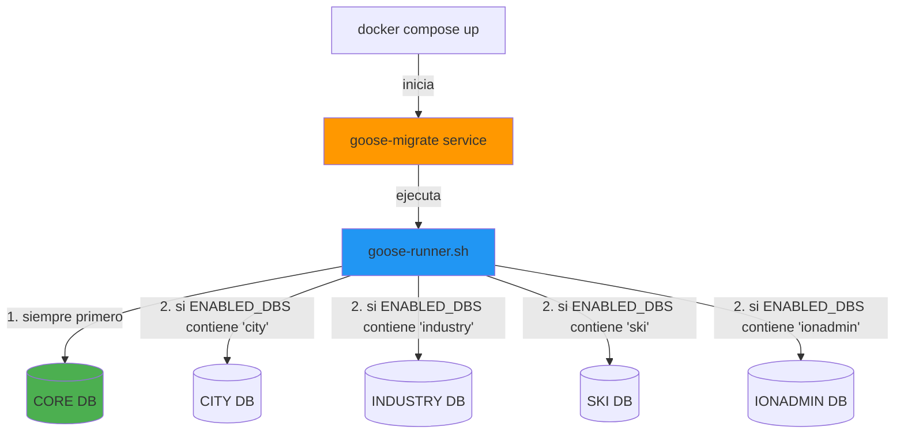

# ION Smart - Database Migrations (goose-go)

Este proyecto utiliza [goose](https://github.com/pressly/goose) para gestionar las migraciones de base de datos de forma versionada e idempotente.

## ✅ Estado actual

**Goose está completamente implementado y operativo.**

Las migraciones se gestionan con archivos SQL versionados en esta carpeta:
- `core/` - Migraciones del módulo CORE (siempre se aplican primero)
- `city/` - Migraciones del módulo CITY (si ENABLED_DBS incluye "city")
- `industry/` - Migraciones del módulo INDUSTRY (si ENABLED_DBS incluye "industry")
- `ski/` - Migraciones del módulo SKI (si ENABLED_DBS incluye "ski")
- `ionadmin/` - Migraciones del módulo IONADMIN (si ENABLED_DBS incluye "ionadmin")

El servicio `goose-migrate` aplica estas migraciones automáticamente en cada `docker compose up`.

## 🏗️ Arquitectura del Sistema

El siguiente diagrama muestra cómo funciona el sistema de migraciones:



**Flujo de ejecución:**
1. Docker Compose inicia el servicio `goose-migrate` después de que la BD esté healthy
2. El servicio ejecuta el script `/docker/db/goose-runner.sh`
3. El script aplica migraciones en orden: **CORE primero**, luego módulos según `ENABLED_DBS`
4. Cada módulo tiene su propia tabla `goose_db_version` para control de versiones

## Estructura de migraciones

```
migrations/
├── core/           # Migraciones del módulo CORE
│   ├── 00001_init.sql
│   ├── 00002_add_modulos.sql
│   └── ...
├── city/           # Migraciones del módulo CITY
│   ├── 00001_init.sql
│   ├── 00002_add_infracciones.sql
│   └── ...
├── industry/       # Migraciones del módulo INDUSTRY
│   ├── 00001_init.sql
│   ├── 00002_add_maquinas.sql
│   └── ...
├── ski/            # Migraciones del módulo SKI
│   └── ...
└── ionadmin/       # Migraciones del módulo IONADMIN
    └── ...
```

## Formato de migraciones SQL

**El proyecto utiliza exclusivamente migraciones SQL.** Las migraciones siguen el formato goose con anotaciones SQL:

```sql
-- +goose Up
-- +goose StatementBegin
CREATE TABLE IF NOT EXISTS ejemplo (
  id INT PRIMARY KEY AUTO_INCREMENT,
  nombre VARCHAR(255) NOT NULL,
  created_at TIMESTAMP DEFAULT CURRENT_TIMESTAMP
) ENGINE=InnoDB DEFAULT CHARSET=utf8mb4 COLLATE=utf8mb4_unicode_ci;
-- +goose StatementEnd

-- +goose Down
-- +goose StatementBegin
DROP TABLE IF EXISTS ejemplo;
-- +goose StatementEnd
```

**Elementos clave:**
- `-- +goose Up`: Define la migración hacia adelante
- `-- +goose Down`: Define el rollback
- `-- +goose StatementBegin/End`: Delimitadores para statements complejos
- **Idempotencia**: Usa `IF NOT EXISTS` / `IF EXISTS` cuando sea posible

## Placeholders en migraciones

Al igual que con los schemas actuales, las migraciones pueden usar placeholders:
- `{{CORE_DB}}`, `{{CITY_DB}}`, `{{INDUSTRY_DB}}`, `{{SKI_DB}}`, `{{IONADMIN_DB}}`

El runner de goose sustituirá estos placeholders antes de aplicar las migraciones.

## Configuración por módulo

Cada módulo tendrá su propia tabla de versiones en su base de datos:
- `core` → `{{CORE_DB}}.goose_db_version`
- `city` → `{{CITY_DB}}.goose_db_version`
- `industry` → `{{INDUSTRY_DB}}.goose_db_version`
- `ski` → `{{SKI_DB}}.goose_db_version`
- `ionadmin` → `{{IONADMIN_DB}}.goose_db_version`

## Orden de aplicación

1. **CORE** siempre primero (contiene tablas base y usuarios)
2. **CITY**, **INDUSTRY**, **SKI**, **IONADMIN** según `ENABLED_DBS` (pueden referenciar CORE con FKs cross-DB)

## Docker Compose - Servicio goose

El servicio `goose-migrate` está configurado en `docker-compose.override.yml`:

```yaml
goose-migrate:
  build:
    context: ./docker/goose
    dockerfile: Dockerfile
  image: ionsmart/goose:latest
  container_name: ionsmart_goose_migrate
  depends_on:
    db:
      condition: service_healthy
    db-init:
      condition: service_completed_successfully
  environment:
    MYSQL_HOST: db
    MYSQL_PORT: 3306
    MYSQL_ROOT_PASSWORD: ${MYSQL_ROOT_PASSWORD:-root_password}
    CORE_DB_NAME: ${CORE_DB_NAME:-core}
    CITY_DB_NAME: ${CITY_DB_NAME:-city}
    INDUSTRY_DB_NAME: ${INDUSTRY_DB_NAME:-industry}
    SKI_DB_NAME: ${SKI_DB_NAME:-ski}
    IONADMIN_DB_NAME: ${IONADMIN_DB_NAME:-ionadmin}
    ENABLED_DBS: ${ENABLED_DBS:-core}
    GOOSE_CMD: ${GOOSE_CMD:-up}
  volumes:
    - ./migrations:/migrations:ro
    - ./docker/db/goose-runner.sh:/goose-runner.sh:ro
  entrypoint: ["bash"]
  command: ["/goose-runner.sh"]
  restart: "no"
```

**Variables de entorno clave:**
- `ENABLED_DBS`: Controla qué módulos migrar (ej: `core,city,industry`)
- `GOOSE_CMD`: Comando a ejecutar (`up`, `down`, `status`, `version`)
- `*_DB_NAME`: Nombres de las bases de datos de cada módulo

## Comandos útiles

```bash
# Aplicar todas las migraciones pendientes (por defecto)
docker compose up goose-migrate

# Ver estado de migraciones de todos los módulos
GOOSE_CMD=status docker compose run --rm goose-migrate

# Aplicar migraciones explícitamente
GOOSE_CMD=up docker compose run --rm goose-migrate

# Rollback última migración de cada módulo
GOOSE_CMD=down docker compose run --rm goose-migrate

# Ver versión actual de las migraciones
GOOSE_CMD=version docker compose run --rm goose-migrate

# Migrar solo módulos específicos
ENABLED_DBS=core,city docker compose run --rm goose-migrate

# Recrear y aplicar migraciones desde cero
docker compose down -v  # ⚠️ Elimina todos los datos
docker compose up
```

## Crear nuevas migraciones

Para crear una nueva migración SQL, usa el siguiente formato de nombre:

```bash
# Opción 1: Usar goose desde el contenedor para generar el archivo
docker compose run --rm goose-migrate goose -dir /migrations/core create add_nueva_tabla sql

# Opción 2: Crear manualmente con el formato correcto
# Nombre: migrations/core/00022_add_nueva_tabla.sql
```

Contenido de ejemplo:

```sql
-- +goose Up
-- +goose StatementBegin
CREATE TABLE IF NOT EXISTS nueva_tabla (
  id INT PRIMARY KEY AUTO_INCREMENT,
  nombre VARCHAR(255) NOT NULL,
  created_at TIMESTAMP DEFAULT CURRENT_TIMESTAMP,
  updated_at TIMESTAMP DEFAULT CURRENT_TIMESTAMP ON UPDATE CURRENT_TIMESTAMP
) ENGINE=InnoDB DEFAULT CHARSET=utf8mb4 COLLATE=utf8mb4_unicode_ci;
-- +goose StatementEnd

-- Índices si son necesarios
-- +goose StatementBegin
CREATE INDEX idx_nueva_tabla_nombre ON nueva_tabla(nombre);
-- +goose StatementEnd

-- +goose Down
-- +goose StatementBegin
DROP TABLE IF EXISTS nueva_tabla;
-- +goose StatementEnd
```

## Notas importantes

- **Numeración secuencial**: Los archivos de migración deben seguir el formato `XXXXX_nombre_descriptivo.sql` donde XXXXX es un número secuencial de 5 dígitos.
- **Cross-DB FKs**: El runner ejecuta las migraciones en orden (core → city/industry/ski/ionadmin) para mantener las FKs cross-DB funcionales.
- **Idempotencia**: Goose gestiona automáticamente qué migraciones ya se aplicaron mediante la tabla `goose_db_version` en cada base de datos.
- **Rollbacks**: Siempre define las secciones `+goose Up` y `+goose Down` para permitir hacer rollback si es necesario.
- **Modo desarrollo**: Las migraciones se aplican automáticamente al iniciar el stack con `docker compose up`.
- **Producción**: En producción, se recomienda ejecutar las migraciones manualmente y revisar el estado antes de aplicar.
- **Solo SQL**: El proyecto actualmente utiliza solo migraciones SQL. La imagen Docker está optimizada para esto (~60MB).

## Best Practices

### ✅ Hacer

- Usar `IF NOT EXISTS` / `IF EXISTS` para idempotencia
- Definir siempre las secciones `Up` y `Down`
- Numerar secuencialmente las migraciones
- Usar nombres descriptivos (ej: `00015_add_usuarios_index.sql`)
- Probar rollbacks en desarrollo antes de aplicar en producción
- Revisar el estado con `GOOSE_CMD=status` después de aplicar migraciones

### ❌ Evitar

- Modificar migraciones ya aplicadas en producción
- Omitir la sección `Down` (dificulta rollbacks)
- Crear migraciones con el mismo número
- Ejecutar migraciones directamente en producción sin revisar

## Troubleshooting

### Las migraciones no se aplican

Verifica que el servicio se está ejecutando:

```bash
docker compose logs goose-migrate
```

### Error de conexión a la base de datos

Asegúrate de que el servicio `db` está healthy:

```bash
docker compose ps db
```

### Ver qué migraciones están aplicadas

```bash
GOOSE_CMD=status docker compose run --rm goose-migrate
```

### Una migración falló a medias

Goose marca la migración como fallida. Corrígela y vuelve a ejecutar:

```bash
# Corregir el archivo SQL
# Luego:
GOOSE_CMD=up docker compose run --rm goose-migrate
```

## Migraciones Go (Opcional - Futuro)

**Nota:** El proyecto actualmente **NO utiliza** migraciones Go. Esta sección es solo informativa para el futuro.

Si en algún momento necesitas lógica compleja en migraciones (condicionales, variables de entorno, transformaciones de datos), podrías usar migraciones Go. Sin embargo, esto requeriría modificar el Dockerfile para incluir el runtime de Go completo.

Ver [`docker/goose/README.md`](../docker/goose/README.md) sección "Soporte para Migraciones Go" para más detalles.

## Referencias

- [goose documentation](https://pressly.github.io/goose/)
- [goose GitHub](https://github.com/pressly/goose)
- [Docker Multi-Stage Builds](https://docs.docker.com/build/building/multi-stage/)
